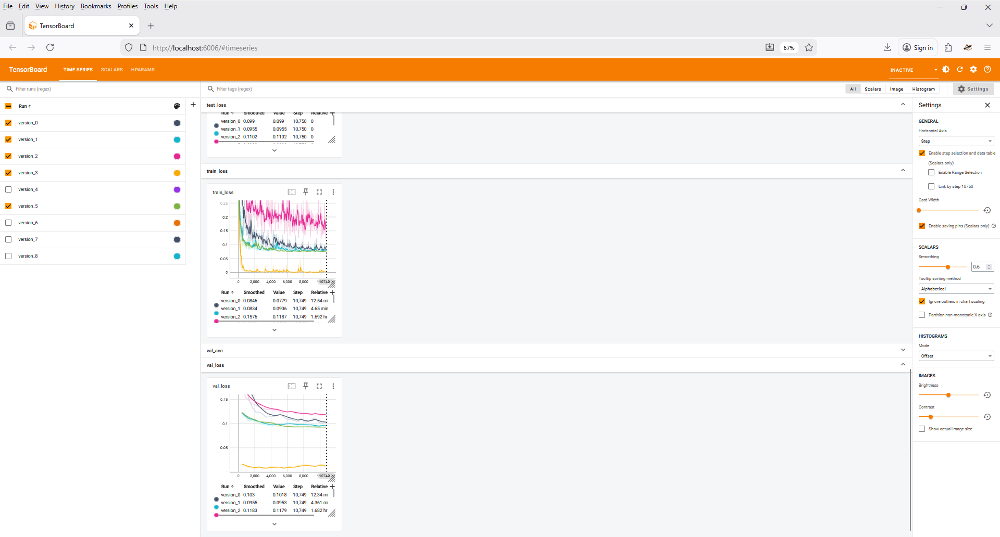
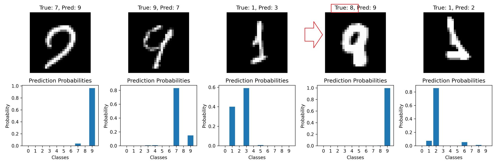

# MNIST Training with PyTorch Lightning and finding mislabelled data 

End-to-end MNIST digit classification using **PyTorch Lightning**, including:
- Baseline training
- Transfer learning
- Hyperparameter optimization
- Model Optimization (Pytorch)
- Clean, reproducible experiment structure
- Checking labelled data discrepancy
- Tensorboard logger integrated for better babysitting



---

## 🚀 Overview

This repository provides a **modular and reproducible** framework for training neural networks on the MNIST dataset using **PyTorch Lightning**.

It is designed to demonstrate:
- Best practices for ML project organization
- Searching  mislabeled  data after initial training
- Lightning abstractions for training and evaluation
- Transfer learning workflows
- Hyperparameter optimization experiments
- Model optimization - to help run on edge devices



The code is intentionally lightweight and easy to extend to other datasets or models.

---

## ✨ Features

- ✅ PyTorch Lightning training loop
- ✅ Modular model and data modules
- ✅ Transfer learning support
- ✅ Hyperparameter optimization (learning rate scheduler, optimizer, etc.)
- ✅ CPU/GPU compatible
- ✅ Clean experiment tracking using tensorboard 
- ✅ Easy to adapt beyond MNIST


---

## 📂 Project Structure

```text
.
├── README.md
├── requirements.txt
├──  README.md
├── DATA/
│   └── MNISTDataModule.py
├── MODELS/
│   ├──LeNetTransfer.py
│   ├── LeNetModel.py
│   ├── ModelsGeneral.py
│   ├── ModelsGeneral.py
|   └── UnetModel.py
├── playground/
│   ├──ImageLosses.py
│   ├──triain_mnist_profiler.py
│   └── maybe_del.py.py
│── train_mnist.py
│── train_transfer_lenet.py
│── hyperparameter_search.py
│── MNIST_simple.yaml
└── tests/
    └── test_mnist.py.py
